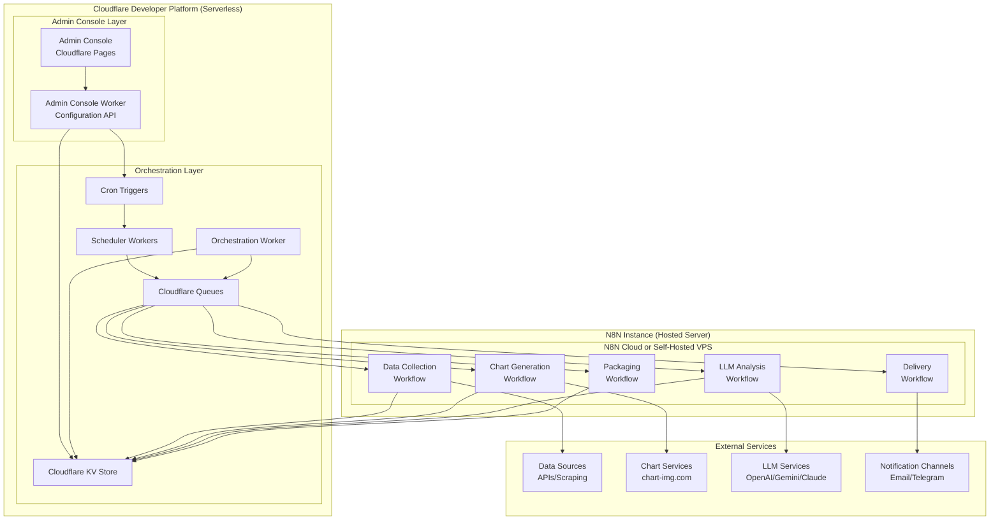
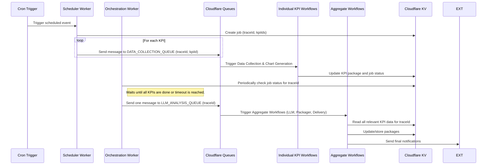
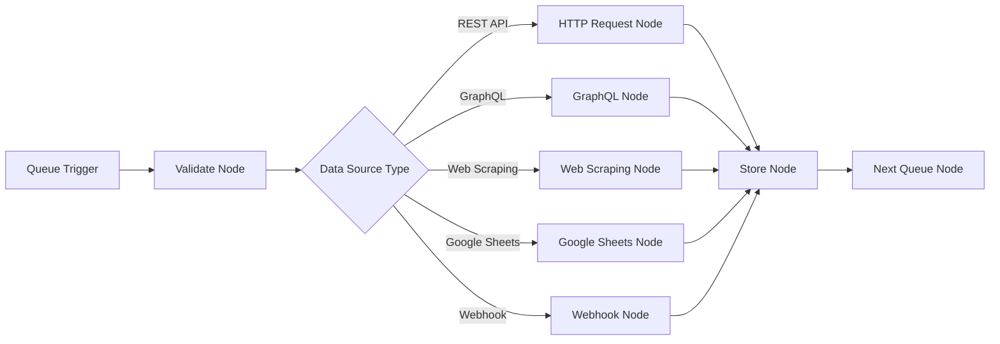
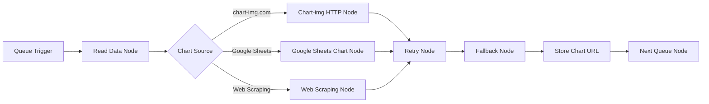
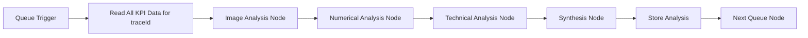
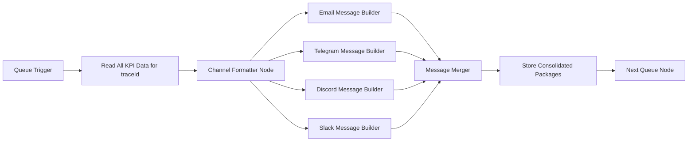
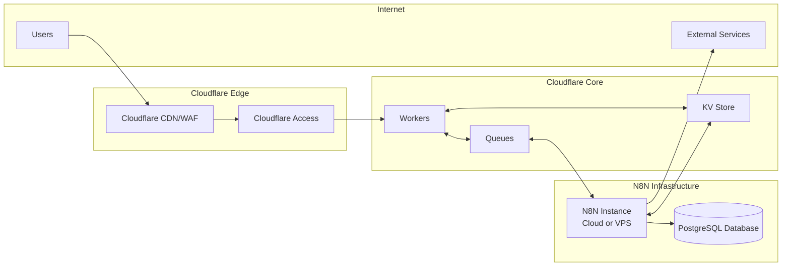

# Design Document

## Overview

The Daily Index Tracker is a hybrid crypto market monitoring system that combines the Cloudflare Developer Platform for serverless components with a hosted N8N instance for workflow automation. The system follows a queue-based, event-driven architecture that ensures scalability, reliability, and modularity.

The design implements a decoupled architecture where serverless components (Admin Console, Scheduler Workers, Queues, KV storage) run on Cloudflare, while workflow processing occurs on a hosted N8N instance (either N8N Cloud or self-hosted on a VPS). Each major process (data collection, chart generation, LLM analysis, packaging, and delivery) operates as an independent N8N workflow, orchestrated through Cloudflare Queues.

## Architecture

### High-Level Architecture



### Orchestration

The orchestration layer is responsible for managing the overall workflow, particularly the fan-in process where individual KPI results are aggregated for downstream analysis.

- **Scheduler Worker**: Initiates the process by fanning out messages to the `DATA_COLLECTION_QUEUE` for each active KPI.
- **Orchestration Worker**: A scheduled Cloudflare Worker that runs periodically to monitor the status of jobs in the KV store. It checks for completed KPIs and timeouts, and when a job is ready, it fans in the results by sending a single message to the `LLM_ANALYSIS_QUEUE` to trigger the aggregate workflows.
- **Job Status Tracking**: A dedicated KV store entry for each job (`traceId`) tracks the status of each KPI, including successes, failures, and timeouts. This allows the Orchestration Worker to determine when to proceed with the next step, even if some data is partial.

### Queue-Based Workflow Orchestration

The system uses five primary Cloudflare Queues to orchestrate the workflow sequence:

1. **DATA_COLLECTION_QUEUE** - Triggers data collection workflows
2. **CHART_GENERATION_QUEUE** - Triggers chart generation workflows
3. **LLM_ANALYSIS_QUEUE** - Triggers LLM analysis workflows
4. **PACKAGING_QUEUE** - Triggers KPI packaging workflows
5. **DELIVERY_QUEUE** - Triggers delivery workflows

### Data Flow Sequence

The data flow follows a fan-out/fan-in pattern to accommodate both parallel individual KPI processing and aggregate analysis that considers all KPIs in a cycle.

1.  **Fan-out (Initiation)**: A Cloudflare Cron Trigger invokes a Scheduler Worker. The worker identifies all KPIs for the current run, creates a job record in KV with a unique `traceId`, and sends one message per KPI to the `DATA_COLLECTION_QUEUE`.
2.  **Individual Processing**: Each KPI is processed independently by the Data Collection and Chart Generation workflows. Each workflow is triggered by a message from the preceding queue and updates the KPI's package in the KV store.
3.  **Fan-in (Aggregation)**: An orchestration mechanism (a dedicated, scheduled Cloudflare Worker) monitors the job status in KV. It waits for all KPIs to complete or reach a timeout threshold, then sends a single aggregate message to the `LLM_ANALYSIS_QUEUE` with either complete or partial data.
4.  **Aggregate Processing**: The LLM Analysis, Packaging, and Delivery workflows process all successfully collected KPIs for the run, with appropriate handling for partial data scenarios.



## Components and Interfaces

### Admin Console

**Technology**: Cloudflare Pages with React/Vue.js frontend
**Authentication**: Cloudflare Access
**Styling**: Modern, minimalistic light theme with full responsiveness

#### Key Features:
- **KPI Management**: CRUD operations for KPI configurations
- **Workflow Control**: Start/Stop/Pause individual N8N workflows via API
- **Schedule Management**: Configure cron expressions and manage Cloudflare Cron Triggers
- **LLM Configuration**: Define analysis chains with JSON prompt structures
- **Monitoring Dashboard**: View system status and logs

#### Admin Console Worker API Endpoints:
```typescript
// KPI Management
POST /api/kpis - Create new KPI
GET /api/kpis - List all KPIs
PUT /api/kpis/:id - Update KPI
DELETE /api/kpis/:id - Delete KPI

// Workflow Management
POST /api/workflows/:id/start - Start N8N workflow
POST /api/workflows/:id/stop - Stop N8N workflow
POST /api/workflows/:id/pause - Pause N8N workflow

// Schedule Management
POST /api/schedules - Create cron trigger
PUT /api/schedules/:id - Update cron trigger
DELETE /api/schedules/:id - Delete cron trigger

// Configuration Management
GET /api/config - Get system configuration
PUT /api/config - Update system configuration
```

### N8N Instance Deployment Options

The N8N workflows can be deployed using one of two production-ready approaches, with local development handled by Docker.

#### Option 1: N8N Cloud (Recommended)
- **Pros**: Fully managed, automatic updates, built-in scaling, no server maintenance.
- **Cons**: Monthly subscription cost, less control over infrastructure.
- **Best for**: Teams wanting minimal operational overhead.

#### Option 2: Self-Hosted N8N on VPS
- **Pros**: Full control, lower long-term costs, custom configurations.
- **Cons**: Requires server management, manual updates, and backup responsibility.
- **Best for**: Teams with DevOps expertise wanting maximum control.

#### Local Development (Docker)
For development and testing, N8N can be run locally using its official Docker image to accelerate iteration and debugging.

#### N8N-Cloudflare Integration
The N8N instance connects to Cloudflare services via:
- **Queue Consumption**: N8N workflows poll Cloudflare Queues for new messages.
- **KV Store Access**: N8N reads/writes data using the Cloudflare KV API.
- **Secret Management**: N8N retrieves credentials from Cloudflare Secrets at runtime.

### N8N Workflows

The N8N workflows are divided into two categories: individual KPI processing and aggregate batch processing.

#### 1. Data Collection Workflow (Individual)
**Trigger**: Message from `DATA_COLLECTION_QUEUE`
**Purpose**: Fetch raw KPI data from configured sources for a single KPI.
**Output**: Updates the KPI package in the KV store and sends a message to the `CHART_GENERATION_QUEUE`.

**Workflow Structure**:


#### 2. Chart Generation Workflow (Individual)
**Trigger**: Message from `CHART_GENERATION_QUEUE`
**Purpose**: Generate a visual chart for a single KPI's data.
**Output**: Updates the KPI package in the KV store with the chart URL and updates the job status.

**Workflow Structure**:


#### 3. LLM Analysis Workflow (Aggregate)
**Trigger**: Message from `LLM_ANALYSIS_QUEUE` containing a `traceId`.
**Purpose**: Generate AI insights for the entire batch of KPIs in a run.
**Output**: Updates all relevant KPI packages in the KV store with analysis and sends a message to the `PACKAGING_QUEUE`.

**Workflow Structure**:


#### 4. Packaging Workflow (Aggregate)
**Trigger**: Message from `PACKAGING_QUEUE` containing a `traceId`.
**Purpose**: Consolidate all KPI data for the run into final delivery packages with proper message formatting for each delivery channel.
**Output**: Stores the final, consolidated package(s) in the KV store and sends a message to the `DELIVERY_QUEUE`.

**Workflow Structure**:


**Message Consolidation Logic**:
- **Single Message Body**: All KPIs for a delivery cycle are formatted into one consolidated message per channel type
- **Channel-Specific Formatting**: Each delivery channel (email, Telegram, Discord, Slack) receives a properly formatted version optimized for that platform
- **Section Organization**: KPIs are organized into logical sections with headers, trend indicators, and analysis summaries
- **Alert Integration**: Alert messages are prominently featured when `alert.triggered` is true for any KPI

#### 5. Delivery Workflow (Aggregate)
**Trigger**: Message from `DELIVERY_QUEUE` containing a `traceId`.
**Purpose**: Send consolidated notifications to configured channels.
**Output**: Delivers the final package to all relevant channels.

### Cloudflare KV Store Schema

#### Job Status Structure
Used to track the progress of a fan-out/fan-in job.
```json
{
  "traceId": "string",
  "timestamp": "ISO8601",
  "status": "processing|complete|partial|failed",
  "kpiIds": ["kpiId1", "kpiId2"],
  "completedKpis": {
    "collection": ["kpiId1"],
    "charting": ["kpiId1"]
  },
  "failedKpis": {
    "collection": ["kpiId2"],
    "charting": []
  },
  "timeout": "ISO8601",
  "partialDelivery": "boolean"
}
```

#### KPI Package Structure
```json
{
  "kpiId": "string",
  "timestamp": "ISO8601",
  "traceId": "string",
  "data": {
    "currentValue": "number",
    "previousValue": "number",
    "changePercent": "number",
    "trend": "up|down|stable"
  },
  "chart": {
    "url": "string",
    "fallbackText": "string",
    "timeRange": "7D|30D|90D"
  },
  "analysis": {
    "imageAnalysis": "string",
    "numericalAnalysis": "string",
    "technicalAnalysis": "string",
    "synthesis": "string"
  },
  "alert": {
    "triggered": "boolean",
    "message": "string",
    "threshold": "number",
    "condition": "<|>|=="
  }
}
```

#### Configuration Schema
```json
{
  "kpis": {
    "kpiId": {
      "name": "string",
      "description": "string",
      "dataSource": {
        "type": "rest|graphql|scraping|sheets|webhook",
        "url": "string",
        "method": "string",
        "headers": "object",
        "credentials": "secretRef"
      },
      "chart": {
        "source": "chart-img|sheets|scraping",
        "timeRange": "7D|30D|90D",
        "fallbackUrl": "string"
      },
      "analysis": {
        "enabled": "boolean",
        "chain": [
          {
            "step": "imageAnalysis|numericalAnalysis|technicalAnalysis|synthesis",
            "model": "openai|gemini|claude",
            "prompt": "string"
          }
        ]
      },
      "alerts": {
        "threshold": "number",
        "condition": "<|>|==",
        "message": "string"
      },
      "schedule": {
        "collection": "cronExpression",
        "delivery": "cronExpression"
      },
      "paused": "boolean"
    }
  },
  "deliveryChannels": {
    "channelId": {
      "type": "email|telegram|discord|slack",
      "config": "object",
      "credentials": "secretRef"
    }
  }
}
```

## Data Models

### Queue Message Schema
The message schema varies depending on whether the queue handles individual or aggregate processing.

```typescript
// For DATA_COLLECTION_QUEUE and CHART_GENERATION_QUEUE
interface IndividualQueueMessage {
  traceId: string;
  kpiId: string;
  timestamp: string;
}

// For LLM_ANALYSIS_QUEUE, PACKAGING_QUEUE, and DELIVERY_QUEUE
interface AggregateQueueMessage {
  traceId: string;
  timestamp: string;
  // kpiIds are retrieved from the Job Status in KV
}
```

### KPI Configuration Model
```typescript
interface KPIConfig {
  id: string;
  name: string;
  description: string;
  dataSource: DataSourceConfig;
  chart: ChartConfig;
  analysis: AnalysisConfig;
  alerts: AlertConfig;
  schedule: ScheduleConfig;
  paused: boolean;
}

interface DataSourceConfig {
  type: 'rest' | 'graphql' | 'scraping' | 'sheets' | 'webhook';
  url: string;
  method?: string;
  headers?: Record<string, string>;
  credentials?: string; // Reference to Cloudflare Secret
}

interface ChartConfig {
  source: 'chart-img' | 'sheets' | 'scraping';
  timeRange: '7D' | '30D' | '90D';
  fallbackUrl?: string;
}

interface AnalysisConfig {
  enabled: boolean;
  chain: AnalysisStep[];
}

interface AnalysisStep {
  step: 'imageAnalysis' | 'numericalAnalysis' | 'technicalAnalysis' | 'synthesis';
  model: 'openai' | 'gemini' | 'claude';
  prompt: string;
}

interface AlertConfig {
  threshold: number;
  condition: '<' | '>' | '==';
  message: string;
}

interface ScheduleConfig {
    collection: string; // cronExpression
    delivery: string; // cronExpression
}
```

## Error Handling

### Retry Strategy
- **Chart Generation**: 3 retries with exponential backoff (1s, 2s, 4s)
- **LLM Analysis**: 2 retries with exponential backoff (2s, 4s)
- **Data Collection**: 3 retries with exponential backoff (1s, 2s, 4s)
- **Delivery**: 2 retries with exponential backoff (5s, 10s)

### Fallback Mechanisms
- **Chart Generation Failure**: Use pre-configured fallback image URL or text summary
- **LLM Analysis Failure**: Deliver KPI package without analysis section
- **Data Collection Failure**: Log error and skip KPI for current cycle
- **Delivery Failure**: Log error and attempt delivery on next scheduled run
- **Partial KPI Collection**: Process and deliver successfully collected KPIs with disclaimer about incomplete data set

### Partial Data Handling
When some KPIs fail during collection or charting phases:

1. **Timeout Mechanism**: Orchestrator waits for a configurable timeout period (e.g., 10 minutes) before proceeding
2. **Partial Processing**: LLM Analysis processes only successfully collected KPIs
3. **Disclaimer Injection**: Packaging workflow adds a disclaimer section indicating partial data delivery
4. **Status Tracking**: Job status marked as "partial" instead of "complete"
5. **Notification Enhancement**: Delivery includes information about which KPIs failed and why

#### Partial Delivery Package Structure
```json
{
  "deliveryStatus": "partial|complete",
  "disclaimer": "This analysis is based on X out of Y KPIs due to collection failures",
  "successfulKpis": ["kpiId1", "kpiId3"],
  "failedKpis": [
    {
      "kpiId": "kpiId2",
      "phase": "collection|charting",
      "error": "Connection timeout to data source"
    }
  ],
  "kpiPackages": [...],
  "aggregateAnalysis": "..."
}
```

### Error Logging Schema
```json
{
  "timestamp": "ISO8601",
  "traceId": "string",
  "kpiId": "string",
  "component": "string",
  "level": "error|warning|info",
  "message": "string",
  "error": "object",
  "retryCount": "number"
}
```

## Testing Strategy

### Unit Testing
- **Admin Console**: Jest/Vitest for React components and API endpoints
- **N8N Workflows**: N8N's built-in testing capabilities for individual nodes
- **Cloudflare Workers**: Miniflare for local testing

### Integration Testing
- **Queue Message Flow**: End-to-end testing of message passing between workflows
- **External Service Integration**: Mock external APIs for reliable testing
- **KV Store Operations**: Test data persistence and retrieval

### Load Testing
- **Concurrent KPI Processing**: Test system with 200 KPIs running simultaneously
- **Queue Throughput**: Test queue processing under high message volume
- **Delivery Scalability**: Test delivery to 5,000 endpoints

### Testing Tools
- **Unit Tests**: Jest, Vitest, Miniflare
- **Integration Tests**: Playwright for Admin Console, custom N8N test workflows
- **Load Tests**: Artillery.io for queue and delivery testing
- **Monitoring**: Cloudflare Analytics and custom dashboards

## Infrastructure Requirements

### N8N Instance Specifications

#### Minimum Requirements (Self-Hosted)
- **CPU**: 2 vCPUs
- **RAM**: 4GB
- **Storage**: 20GB SSD
- **Network**: 1Gbps connection
- **OS**: Ubuntu 20.04+ or Docker-compatible environment

#### Recommended Requirements (Production)
- **CPU**: 4 vCPUs
- **RAM**: 8GB
- **Storage**: 50GB SSD
- **Network**: 1Gbps connection with low latency to Cloudflare edge
- **Backup**: Automated daily backups of N8N database and workflows

#### Scaling Considerations
- **Horizontal Scaling**: Multiple N8N instances can process different KPIs
- **Vertical Scaling**: Increase resources based on workflow complexity and volume
- **Database**: PostgreSQL recommended for production (SQLite for development)

### Cloudflare Resource Limits
- **KV Store**: 1GB per namespace (sufficient for KPI packages)
- **Queues**: 10,000 messages per queue (adequate for workflow orchestration)
- **Workers**: 128MB memory, 30-second execution time per invocation
- **Cron Triggers**: Up to 1,000 scheduled triggers per account

### Network Architecture


## Security Considerations

### Authentication & Authorization
- **Admin Console**: Cloudflare Access with SSO integration
- **N8N API**: API key authentication for workflow management
- **External Services**: Credentials stored in Cloudflare Secret Management

### Data Protection
- **Secrets Management**: All API keys and credentials stored in Cloudflare Secrets
- **Data Encryption**: All data encrypted in transit and at rest
- **Access Control**: Principle of least privilege for all components

### Network Security
- **HTTPS Only**: All communications over HTTPS
- **CORS Configuration**: Strict CORS policies for Admin Console
- **Rate Limiting**: Cloudflare rate limiting for all public endpoints