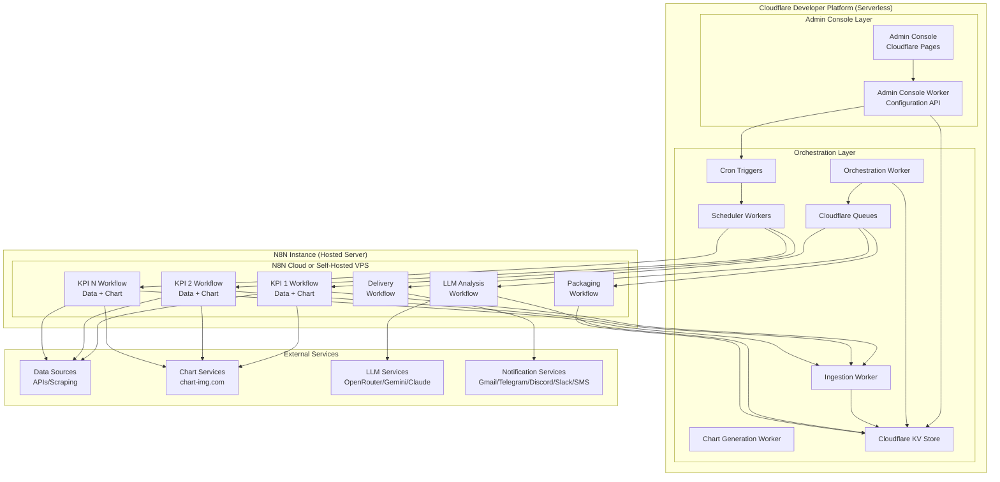
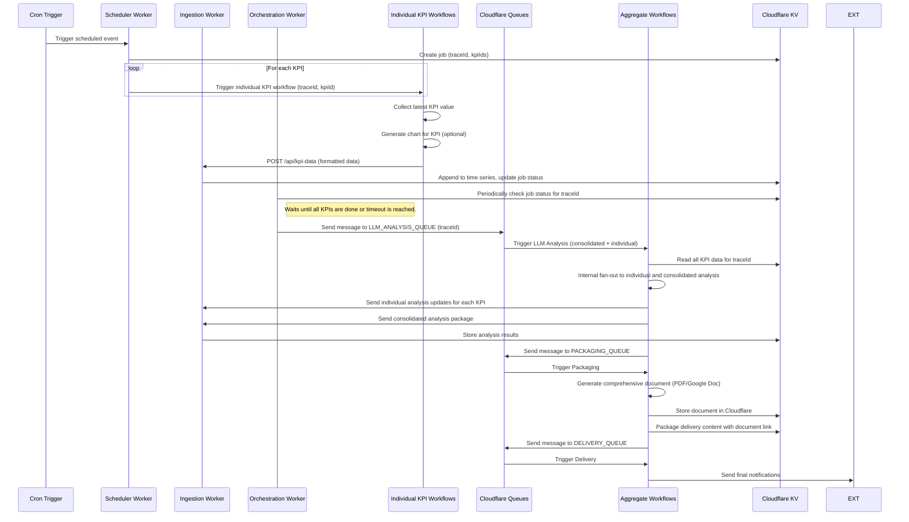
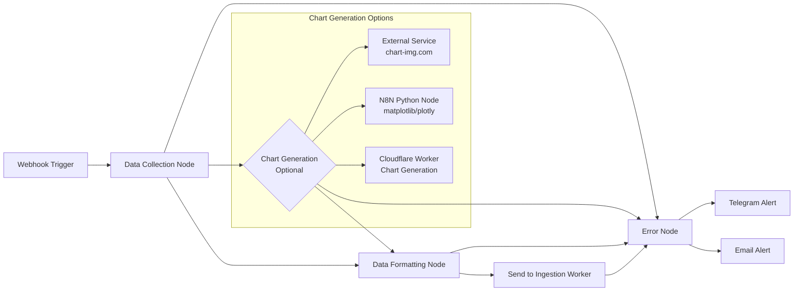
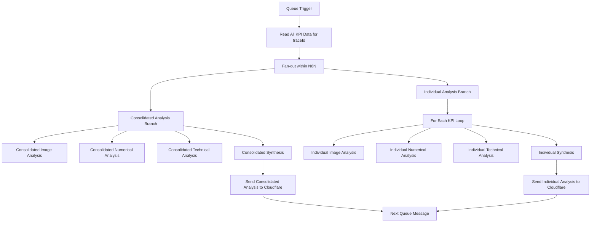
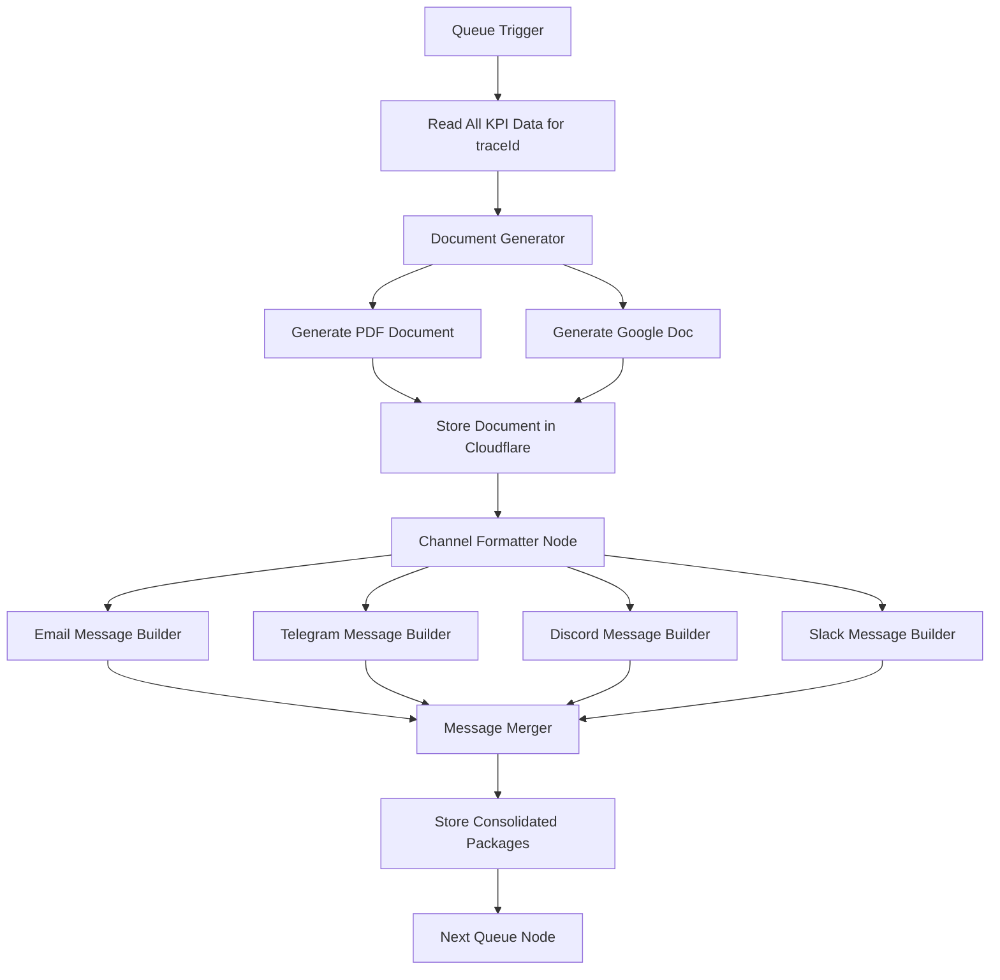
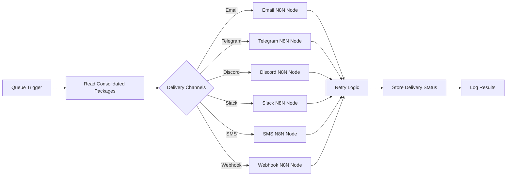
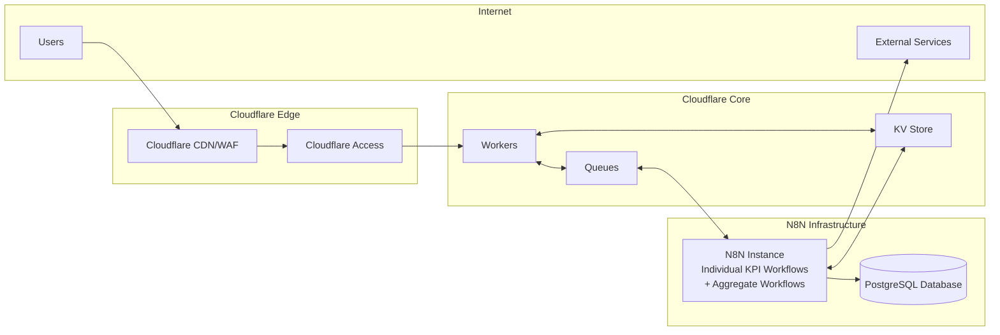

# Design Document

## Overview

The Daily Index Tracker is a hybrid crypto market monitoring system that combines the Cloudflare Developer Platform for serverless components with a hosted N8N instance for workflow automation. The system follows a queue-based, event-driven architecture that ensures scalability, reliability, and modularity.

The design implements a decoupled architecture where serverless components (Admin Console, Scheduler Workers, Queues, KV storage) run on Cloudflare, while workflow processing occurs on a hosted N8N instance (either N8N Cloud or self-hosted on a VPS). Each KPI has its own dedicated N8N workflow that handles both data collection and chart generation, while aggregate processes (LLM analysis, packaging, and delivery) operate as shared N8N workflows orchestrated through Cloudflare Queues.

## Architecture

### High-Level Architecture



### Orchestration

The orchestration layer is responsible for managing the overall workflow, particularly the fan-in process where individual KPI results are aggregated for downstream analysis.

- **Scheduler Worker**: Initiates the process by triggering the individual N8N workflow (via webhook) for each active KPI.
- **Orchestration Worker**: A scheduled Cloudflare Worker that runs periodically (configurable in minutes via the Admin Console) to monitor the status of jobs in the KV store. It checks for completed KPIs and timeouts, and when a job is ready, it fans in the results by sending a single message to the `LLM_ANALYSIS_QUEUE` to trigger the aggregate workflows. The polling frequency and job timeout threshold are configurable in the Admin Console.
- **Job Status Tracking**: A dedicated KV store entry for each job (`traceId`) tracks the status of each KPI, including successes, failures, and timeouts. This allows the Orchestration Worker to determine when to proceed with the next step, even if some data is partial.

### Workflow Orchestration

The system uses direct N8N workflow triggering for individual KPIs and Cloudflare Queues for aggregate processing:

1. **Individual KPI Workflows** - Each KPI has its own N8N workflow triggered via a unique webhook by the Cloudflare Worker
2. **LLM_ANALYSIS_QUEUE** - Triggers LLM analysis workflows for consolidated and individual analysis
3. **PACKAGING_QUEUE** - Triggers KPI packaging workflows
4. **DELIVERY_QUEUE** - Triggers delivery workflows

**Note**: This design prioritizes direct webhook triggering over queue-based individual KPI processing for better performance and simpler architecture, while maintaining queues for aggregate processing workflows.

### Data Flow Sequence

The data flow follows a fan-out/fan-in pattern where each KPI is processed by its own dedicated N8N workflow, then aggregated for analysis and delivery.

1.  **Fan-out (Initiation)**: A Cloudflare Cron Trigger invokes a Scheduler Worker. The worker identifies all KPIs for the current run, creates a job record in KV with a unique `traceId`, and triggers each KPI's individual N8N workflow via a unique webhook URL.
2.  **Individual KPI Processing**: Each KPI has its own dedicated N8N workflow that handles data collection and optional chart generation. After processing, the workflow sends a formatted data payload (containing the latest value and optional chart URL) to the Ingestion Worker's /api/kpi-data endpoint.
3.  **Fan-in (Aggregation)**: An orchestration mechanism (a dedicated, scheduled Cloudflare Worker) monitors the job status in KV. It waits for all KPI workflows to complete or reach a timeout threshold, then triggers the LLM analysis phase.
4.  **Aggregate Processing**: Once all KPIs have been collected, the system triggers LLM analysis (both consolidated analysis across all KPIs and individual deep dives for each KPI), followed by packaging and delivery workflows.



## Components and Interfaces

### Admin Console

**Technology**: Cloudflare Pages with React/Vue.js frontend
**Authentication**: Cloudflare Access
**Styling**: Modern, minimalistic light theme with full responsiveness

#### Key Features:
- **KPI Registry Management**: Simple CRUD operations for KPI registry (name, description, webhook URL, analysis parameters)
- **Workflow Control**: Start/Stop/Pause individual N8N workflows by making authenticated requests to the N8N REST API
- **Schedule Management**: Configure cron expressions and manage Cloudflare Cron Triggers
- **Job Lifecycle Management**: Configure job-level settings, such as timeout thresholds and rules for partial data delivery
- **LLM Configuration**: Define analysis chains with JSON prompt structures
- **Retry Configuration**: Configure retry counts and backoff intervals for all system components
- **Fallback Configuration**: Configure fallback image URLs, fallback text, and disclaimer messages
- **Monitoring Dashboard**: View system status and logs. Key metrics to track include queue depth, job completion times, KPI failure rates, Worker execution times, and LLM API latency
- **N8N Workflow Linking**: Link each KPI registry entry to its corresponding N8N workflow webhook URL

**Note**: Data sources, chart settings, and collection logic are configured entirely within the individual N8N workflows. The Admin Console only manages the KPI registry, analysis parameters, and system-level configurations.

**Note**: The Admin Console manages KPI configurations and settings, but the actual N8N workflows for each KPI must be configured separately within the N8N instance. 

#### Admin Console Worker API Endpoints:
```python
# KPI Registry Management (simplified - no data source/chart configs)
# POST /api/kpis - Create new KPI registry entry (name, description, webhook URL, analysis config)
# GET /api/kpis - List all KPI registry entries
# PUT /api/kpis/:id - Update KPI registry entry
# DELETE /api/kpis/:id - Delete KPI registry entry

# Workflow Management (controls N8N workflows via API)
# POST /api/workflows/:id/start - Start N8N workflow
# POST /api/workflows/:id/stop - Stop N8N workflow
# POST /api/workflows/:id/pause - Pause N8N workflow

# Schedule Management
# POST /api/schedules - Create cron trigger
# PUT /api/schedules/:id - Update cron trigger
# DELETE /api/schedules/:id - Delete cron trigger

# Configuration Management
# GET /api/config - Get system configuration
# PUT /api/config - Update system configuration
# PUT /api/config/retry - Update retry settings for all components
# PUT /api/config/fallback - Update fallback settings (URLs, text, disclaimers)

# Historical Data Import
# POST /api/kpis/:id/import - Import historical CSV data with validation and error logging

# Example endpoint implementation structure:
from dataclasses import dataclass
from typing import List, Dict, Any, Optional

@dataclass
class KPIRegistryEntry:
    id: str
    name: str
    description: str
    webhook_url: str
    analysis_config: Dict[str, Any]
    created_at: str
    updated_at: str
```

### Ingestion Worker

**Technology**: Cloudflare Worker
**Purpose**: Receive KPI data from N8N workflows and manage KV store updates
**Authentication**: Validates requests using shared secret or API key

#### Key Responsibilities:
- **Data Validation**: Validates incoming KPI data structure and content
- **Time Series Management**: Appends new data points to existing time series in KV
- **KPI Package Creation**: Creates initial KPI packages for downstream processing
- **Job Status Tracking**: Updates job completion status for orchestration
- **Error Handling**: Processes both success and error responses from N8N workflows
- **Idempotency**: Prevents duplicate data points for the same timestamp and KPI

### Chart Generation Worker

**Technology**: Cloudflare Worker with Python runtime or external service integration
**Purpose**: Generate charts for KPIs, especially efficient for large time series data
**Authentication**: Internal service authentication

#### Key Responsibilities:
- **Time Series Chart Generation**: Create charts from historical KPI data stored in KV
- **Multiple Chart Types**: Support line charts, candlestick charts, bar charts, etc.
- **Efficient Processing**: Optimized for large datasets (e.g., BTC price data)
- **Chart Storage**: Store generated charts in Cloudflare R2 or external storage
- **Format Support**: Generate charts in PNG, SVG, or interactive HTML formats

#### Chart Generation Options:
1. **Python Libraries**: matplotlib, plotly, seaborn for complex visualizations
2. **JavaScript Libraries**: Chart.js, D3.js for web-optimized charts
3. **External Services**: chart-img.com for simple chart requirements
4. **Hybrid Approach**: Use appropriate method based on data size and complexity

#### Ingestion Worker API Endpoints:
```python
# POST /api/kpi-data - Receive successful KPI data from N8N workflows
# POST /api/kpi-error - Receive error notifications from N8N workflows
# GET /api/health - Health check endpoint for monitoring

# Example endpoint handler structure:
from dataclasses import dataclass
from typing import Dict, Any

@dataclass
class KPIDataRequest:
    trace_id: str
    kpi_id: str
    timestamp: str
    kpi_type: str
    data: Dict[str, Any]
    metadata: Dict[str, Any]
```

#### Chart Generation Worker API Endpoints:
```python
# POST /api/charts/generate - Generate chart for specific KPI and time range
# GET /api/charts/:chartId - Retrieve generated chart
# POST /api/charts/batch - Generate multiple charts for a traceId
# GET /api/charts/health - Health check endpoint for monitoring

# Example chart generation request structure:
@dataclass
class ChartGenerationRequest:
    kpi_id: str
    time_range: str
    chart_type: str
    data_points: List[Dict[str, Any]]
```

#### Data Processing Flow:
1. **Request Validation**: Validates request structure and authentication
2. **Flexible JSON Parsing**: Parses incoming JSON payload based on finalized N8N workflow output format
3. **Duplicate Check**: Ensures idempotency by checking for existing data points
4. **Time Series Update**: Appends data to `timeseries:{kpiId}` in KV
5. **Package Creation**: Creates `package:{traceId}:{kpiId}` entry
6. **Job Status Update**: Updates `job:{traceId}` with completion status
7. **Error Logging**: Logs any processing errors for troubleshooting

**Note**: The Ingestion Worker implementation will be finalized after N8N workflows are configured and sample JSON payloads are provided.

### N8N Integration

#### N8N Instance Endpoints
- **Development**: Docker instance of N8N on `localhost:5678`
- **Production**: VPS hosted instance of N8N on a domain/endpoint to be specified

#### N8N-Cloudflare Integration
The integration between N8N and Cloudflare follows these patterns:

**Individual KPI Workflows (Triggered by Cloudflare)**:
- **Webhook Triggers**: Cloudflare Scheduler Worker triggers individual N8N workflows via direct webhook calls
- **Data Submission**: N8N workflows send collected data to Cloudflare Ingestion Worker endpoints
- **Error Reporting**: N8N workflows send error notifications to Ingestion Worker and direct administrator alerts

**Aggregate Workflows (Triggered by Cloudflare Queues)**:
- **Queue Consumption**: N8N aggregate workflows (LLM Analysis, Packaging, Delivery) poll Cloudflare Queues for new messages
- **KV Store Access**: N8N reads all KPI data for analysis using Cloudflare API key authentication
- **Internal Processing**: N8N handles fan-out to individual and consolidated analysis internally
- **Analysis Submission**: N8N sends analysis results back to Cloudflare Ingestion Worker for each KPI and consolidated package
- **Notification Delivery**: N8N handles all notification delivery through dedicated nodes
- **Credential Management**: N8N manages notification service credentials internally

### N8N Workflows

The N8N workflows are divided into individual KPI workflows (one per KPI) and aggregate batch processing workflows.

#### 1. Individual KPI Workflows (One per KPI)
**Trigger**: Direct webhook trigger from Cloudflare Worker
**Purpose**: Handle complete processing for a single KPI - data collection and optional chart generation.
**Output**: Sends a formatted data payload to the Ingestion Worker, which is responsible for updating the KV store and job status.

**Workflow Structure**:


**Chart Generation Options**:
The chart generation step within the N8N workflow is optional and configurable based on the KPI's requirements. The choice of method depends on factors like data complexity, performance needs, and cost. The N8N workflow can be configured to use one of the following methods:

- **External Services (e.g., chart-img.com)**: Ideal for simple, quick chart generation with minimal configuration. The N8N workflow makes a direct API call to the service.
- **N8N Internal Nodes (e.g., Python)**: For moderately complex visualizations where the data is already available within the workflow. Uses libraries like matplotlib or plotly.
- **Dedicated Cloudflare Worker**: The preferred method for KPIs with large time series (e.g., historical BTC price). To generate a chart, the N8N workflow makes an authenticated API call to the `Chart Generation Worker` (`POST /api/charts/generate`), which then reads the full time series from KV storage and returns a chart URL. This approach is more efficient as it avoids transferring large datasets to N8N.

**Error Handling Flow**:
- Each processing node connects to a centralized Error Node
- N8N performs configurable retry attempts (3 retries with exponential backoff)
- On final failure, Error Node sends direct alerts to system administrator
- Error details are also sent to Ingestion Worker for centralized logging


**Key Features**:
- Each KPI has its own dedicated N8N workflow (configured manually in N8N)
- Workflow handles data collection and optional chart generation in sequence
- Only the latest value is queried and added to the time series in Cloudflare KV
- Optimized for time series generation without querying entire historical data each run
- Error handling with retry logic and direct administrator alerts on failure
- Configuration updates are performed entirely manually in N8N interface

**Data Flow to Cloudflare**:
The N8N workflow sends data back to the Ingestion Worker via HTTP POST requests. The exact JSON payload format will be determined after the N8N workflows are configured, as each workflow may have different output structures.

**Implementation Approach**:
1. **N8N Workflow Configuration**: Individual KPI workflows will be configured first in N8N
2. **Sample JSON Payload**: Once workflows are configured, sample JSON payloads will be provided for each workflow type
3. **Ingestion Worker Configuration**: The Ingestion Worker will be configured to handle the finalized JSON payload structures

**Expected Payload Elements** (subject to change based on N8N workflow outputs):
```python
# Preliminary classes - to be updated based on actual N8N workflow outputs
from dataclasses import dataclass
from typing import Any, Optional, Dict

@dataclass
class KPIDataUpdate:
    kpi_id: str                # KPI identifier
    trace_id: str              # Required for job status tracking
    timestamp: str             # ISO 8601 timestamp
    kpi_type: str              # Helps determine how to parse the data structure
    data: Any                  # Flexible data structure - varies significantly by KPI type
                              # Could be:
                              # - Simple number for ratios (MVRV Z Score: 2.5)
                              # - Dict for complex data (Price: {"value": 45000, "volume": 1000000})
                              # - List for multi-dimensional data
    chart: Optional[Dict[str, str]] = None      # Optional chart information
    metadata: Optional[Dict[str, Any]] = None   # Optional metadata
    additional_fields: Optional[Dict[str, Any]] = None  # Maximum flexibility
    
    def to_dict(self) -> Dict[str, Any]:
        """Convert to dictionary for JSON serialization"""
        result = {
            "kpiId": self.kpi_id,
            "traceId": self.trace_id,
            "timestamp": self.timestamp,
            "kpiType": self.kpi_type,
            "data": self.data
        }
        if self.chart:
            result["chart"] = self.chart
        if self.metadata:
            result["metadata"] = self.metadata
        if self.additional_fields:
            result.update(self.additional_fields)
        return result

# Error payload structure - also subject to N8N workflow configuration
@dataclass
class KPIErrorUpdate:
    kpi_id: str                # KPI identifier
    trace_id: str              # Required for job status tracking
    timestamp: str             # ISO 8601 timestamp
    error: str                 # Error message
    component: Optional[str] = None     # Component where error occurred
    retry_count: Optional[int] = None   # Number of retry attempts
    additional_fields: Optional[Dict[str, Any]] = None  # Additional error fields
    
    def to_dict(self) -> Dict[str, Any]:
        """Convert to dictionary for JSON serialization"""
        result = {
            "kpiId": self.kpi_id,
            "traceId": self.trace_id,
            "timestamp": self.timestamp,
            "error": self.error
        }
        if self.component:
            result["component"] = self.component
        if self.retry_count is not None:
            result["retryCount"] = self.retry_count
        if self.additional_fields:
            result.update(self.additional_fields)
        return result
```

**Flexibility Approach**:
- **KPI Type Field**: Used to determine how to parse and store the data
- **Completely Flexible Data**: No assumptions about data structure
- **Schema Evolution**: Final KV store schema will be designed after analyzing actual N8N workflow outputs
- **Type-Specific Handling**: Ingestion Worker will handle different KPI types appropriately

**Note**: The Ingestion Worker will be designed with flexible JSON parsing capabilities to accommodate the actual payload structures generated by the configured N8N workflows.


**Time Series Storage Pattern**:
- Each KPI maintains a time series in Cloudflare KV with key pattern: `timeseries:{kpiId}`
- New data points are appended to the existing time series array
- Historical data is preserved for trend analysis and charting
- Storage format: `{ timestamps: [...], values: [...], metadata: [...] }`

#### 2. LLM Analysis Workflow (Aggregate)
**Trigger**: Message from `LLM_ANALYSIS_QUEUE` containing a `traceId`.
**Purpose**: Generate AI insights with both consolidated analysis across all KPIs and individual deep dives for each KPI.
**Output**: Sends analysis updates for each individual KPI and the overall consolidated package back to Cloudflare Ingestion Worker.

**Workflow Structure**:


**Analysis Processing**:
- **Input**: All KPI data for the `traceId` is passed to the N8N workflow
- **Internal Fan-out**: N8N handles the fan-out to both consolidated and individual analysis branches
- **Consolidated Analysis**: Cross-KPI insights, correlations, and market overview
- **Individual Analysis**: Detailed analysis for each KPI separately with specific insights and recommendations
- **Output**: N8N sends analysis updates back to Cloudflare for each KPI and the consolidated package

#### 3. Packaging Workflow (Aggregate)
**Trigger**: Message from `PACKAGING_QUEUE` containing a `traceId`.
**Purpose**: Consolidate all KPI data for the run into final delivery packages with proper message formatting for each delivery channel, and create a comprehensive document (PDF or Google Doc) stored in Cloudflare.
**Output**: Stores the final, consolidated package(s) in the KV store, creates and stores a comprehensive document, and sends a message to the `DELIVERY_QUEUE`.

**Workflow Structure**:


**Document Generation**:
- **Comprehensive Document**: Creates a detailed PDF or Google Doc containing all KPI data, charts, and analysis
- **Document Storage**: Stores the generated document in Cloudflare R2 or KV store with a unique URL
- **Document Structure**: Organized with executive summary, individual KPI sections, charts, analysis, and appendices

**Message Consolidation Logic**:
- **Document-Centric Messages**: Individual channel messages contain a brief summary and link to the comprehensive document
- **Channel-Specific Formatting**: Each delivery channel receives a properly formatted message optimized for that platform, with document link
- **Brief Summary**: Messages include key highlights and alerts, with full details available in the linked document
- **Alert Integration**: Alert messages are prominently featured in both the brief message and the comprehensive document

#### 4. Delivery Workflow (Aggregate)
**Trigger**: Message from `DELIVERY_QUEUE` containing a `traceId`.
**Purpose**: Send consolidated notifications to configured channels using dedicated N8N notification nodes.
**Output**: Delivers the final package to all relevant channels through specialized N8N nodes for each notification type.

**Workflow Structure**:


**N8N Notification Nodes**:
- **Email Node**: Uses Gmail API, SMTP, or SendGrid for email delivery
- **Telegram Node**: Native N8N Telegram Bot API integration
- **Discord Node**: Discord webhook or bot API integration
- **Slack Node**: Native N8N Slack API integration
- **SMS Node**: Twilio, AWS SNS, or other SMS provider integration
- **Webhook Node**: Generic HTTP webhook for custom integrations


## Data Storage and Retrieval

### Historical Data Initialization

For the initial go-live of the application, historical data will need to be manually populated since the N8N workflows are designed to collect only the latest data points during regular operation.

#### Go-Live Data Preparation
- **CSV Data Format**: Historical data for each KPI must be provided in a CSV file with the following columns: `timestamp`, `value`, and an optional `metadata` column.
  - `timestamp`: An ISO 8601 formatted string (e.g., `2025-08-12T12:00:00Z`).
  - `value`: A numerical value for the KPI.
  - `metadata`: A JSON string representing any metadata for the data point (e.g., `'{"source": "manual_import"}'`).
- **Upload Mechanism**: The Admin Console will provide a dedicated interface for historical data import. The user will select the target KPI and upload the corresponding CSV file.
- **Processing**: The Admin Console Worker will receive the file, parse the CSV data, validate each row, and append the data points to the `timeseries:{kpiId}` structure in Cloudflare KV, ensuring the historical data is correctly backfilled before the system goes live.
- **Validation**: A comprehensive data validation step is performed, checking for:
  - Valid ISO 8601 timestamp format
  - Numerical value validation
  - Chronological order verification
  - Duplicate timestamp detection
- **Error Logging**: Validation errors are written to a dedicated log (`import-errors:{kpiId}:{timestamp}`) for system administrator manual investigation and correction
- **Import Status**: Each import operation creates a status record with success/failure counts and error references

#### Post Go-Live Operation
Once the system is live, the N8N workflows will append new data points to the existing historical time series, maintaining continuity between the manually imported historical data and the automated collection process.

### N8N to Cloudflare Data Flow

#### Data Submission Process
1. **N8N Workflow Completion**: Each KPI workflow completes data collection and chart generation.
2. **Data Formatting**: N8N formats the data according to the `KPIDataUpdate` interface.
3. **HTTP Request to Cloudflare**: N8N sends a POST request to the Ingestion Worker's endpoint (`/api/kpi-data`).
4. **Data Validation**: The Ingestion Worker validates the incoming data structure.
5. **Time Series Update**: The worker appends the new data point to the existing time series in KV.
6. **KPI Package Creation**: The worker creates the initial `KPI Package` in KV (using a key like `package:{traceId}:{kpiId}`), populating it with the data and chart information from the request. This package is then ready for downstream workflows.
7. **Job Status Update**: The worker updates the overall job status in KV to track completion of the individual KPI.

#### Time Series Append Mechanism
```python
# Note: The following is a conceptual illustration.
# The final implementation of the Ingestion Worker's logic and the precise 
# KV store schema will be determined once sample data payloads from the 
# configured N8N workflows are available. The worker will be designed 
# to flexibly handle various data structures based on a 'kpi_type' identifier.

import json
from typing import Optional, Dict, Any
from datetime import datetime

async def append_to_time_series(kv_store, kpi_id: str, new_data: KPIDataUpdate) -> None:
    """
    Conceptual append operation (performed by Ingestion Worker)
    """
    # 1. Retrieve existing time series data for the given kpi_id
    time_series_key = f"timeseries:{kpi_id}"
    existing_data = await kv_store.get(time_series_key)
    
    if existing_data:
        time_series = TimeSeriesData.from_dict(json.loads(existing_data))
    else:
        time_series = create_new_time_series(kpi_id)
    
    # 2. Perform an idempotency check to ensure the data point for the
    #    given timestamp doesn't already exist
    if is_duplicate(time_series, new_data.timestamp):
        return  # Skip update
    
    # 3. Parse the flexible 'new_data.data' payload based on 'new_data.kpi_type'
    #    to extract the relevant value and metadata. This logic will be
    #    implemented once N8N output formats are finalized.
    new_point = parse_kpi_data(new_data)
    
    # 4. Append the new, parsed data point to the time series array
    time_series.data_points.append(new_point)
    time_series.last_updated = new_data.timestamp
    time_series.metadata.total_points += 1
    
    # 5. Store the updated time series back into the KV store
    await kv_store.put(time_series_key, json.dumps(time_series.to_dict()))

def create_new_time_series(kpi_id: str) -> TimeSeriesData:
    """Create a new time series data structure"""
    return TimeSeriesData(
        kpi_id=kpi_id,
        kpi_type="unknown",  # Will be updated when first data arrives
        data_points=[],
        last_updated=datetime.utcnow().isoformat(),
        metadata=TimeSeriesMetadata(
            source="n8n-workflow",
            created=datetime.utcnow().isoformat(),
            total_points=0
        )
    )

def is_duplicate(time_series: TimeSeriesData, timestamp: str) -> bool:
    """Check if timestamp already exists in time series"""
    return any(point.timestamp == timestamp for point in time_series.data_points)

def parse_kpi_data(new_data: KPIDataUpdate) -> TimeSeriesPoint:
    """Parse KPI data based on type - to be implemented based on actual N8N outputs"""
    # This will be implemented once N8N output formats are finalized
    # For now, assume data contains a 'value' field
    if isinstance(new_data.data, dict) and 'value' in new_data.data:
        value = new_data.data['value']
    elif isinstance(new_data.data, (int, float)):
        value = new_data.data
    else:
        # Handle complex data structures based on kpi_type
        value = extract_primary_value(new_data.data, new_data.kpi_type)
    
    return TimeSeriesPoint(
        timestamp=new_data.timestamp,
        value=value,
        metadata=new_data.metadata
    )

def extract_primary_value(data: Any, kpi_type: str) -> float:
    """Extract primary numeric value based on KPI type"""
    # Implementation will depend on actual N8N workflow outputs
    # This is a placeholder for type-specific parsing logic
    if kpi_type == "cbbi-multi":
        # Handle CBBI multi-KPI data structure
        pass
    elif kpi_type == "cmc-multi":
        # Handle CMC multi-KPI data structure
        pass
    
    # Default fallback
    return 0.0
```

#### Data Retrieval for Analysis
- **LLM Analysis Phase**: Retrieves complete time series for trend analysis
- **Chart Generation**: Uses time series data for historical context
- **Delivery Phase**: Accesses latest values and trends for reporting

### Data Retention and Archiving

To ensure the system remains performant and cost-effective over time, a data retention policy will be implemented. Time series data stored in Cloudflare KV is intended for recent trend analysis and will not grow indefinitely.

- **Policy**: Time series data older than 365 days will be automatically exported to a cold storage solution like Cloudflare R2.
- **Pruning**: Once successfully archived, the exported data will be pruned from the KV store.
- **Access**: Access to archived data will be handled separately and is not part of the real-time monitoring dashboard.

### Cloudflare KV Store Schema

#### Time Series Structure (Flexible Schema)
Used to store historical data for each KPI (Key: `timeseries:{kpiId}`).
**Note**: The final structure will be determined after N8N workflows are configured and actual data patterns are analyzed.

```json
{
  "kpiId": "string",
  "name": "string",
  "kpiType": "string", // Determines how to interpret dataPoints structure
  "lastUpdated": "ISO8601",
  
  "dataPoints": [
    {
      "timestamp": "ISO8601",
      "data": "any", // Flexible structure based on KPI type
      "metadata": {
        "source": "string",
        "quality": "string",
        "confidence": "number"
      }
    }
  ],
  
  // Optional statistics - calculated if applicable for the KPI type
  "statistics": {
    [key: string]: any // Flexible statistics based on data type
  }
}
```

**Data Point Examples by KPI Type**:
```json
// Price KPI (BTC/USD)
"data": {
  "price": 45000,
  "volume": 1000000,
  "ohlc": { "open": 44500, "high": 45200, "low": 44300, "close": 45000 }
}

// MVRV Z Score
"data": {
  "mvrv": 2.5,
  "zScore": 1.8,
  "interpretation": "slightly overvalued"
}

// Fear & Greed Index
"data": {
  "score": 75,
  "classification": "greed",
  "components": { "volatility": 80, "momentum": 70, "social": 75 }
}

// Network Hash Rate
"data": {
  "hashRate": 150000000000000000000,
  "difficulty": 25000000000000,
  "unit": "TH/s"
}
```

#### Job Status Structure
Used to track the progress of a fan-out/fan-in job (Key: `job:{traceId}`).
```json
{
  "traceId": "string",
  "timestamp": "ISO8601",
  "status": "processing|complete|partial|failed",
  "kpiIds": ["kpiId1", "kpiId2"],
  "completedKpis": ["kpiId1"],
  "failedKpis": [
    {
      "kpiId": "kpiId2",
      "error": "Connection timeout to data source"
    }
  ],
  "timeout": "ISO8601",
  "partialDelivery": "boolean"
}
```

#### KPI Package Structure (Flexible Schema)
**Note**: This is a preliminary structure. The final KV store schema will be determined after N8N workflows are configured and actual data structures are analyzed.

```json
{
  "kpiId": "string",
  "name": "string",
  "category": "string",
  "timestamp": "ISO8601",
  "traceId": "string",
  
  // Core fields - always present
  "data": {
    "value": "any", // Can be number, object, array depending on KPI type
    "unit": "string",
    "timestamp": "ISO8601"
  },
  
  // Optional fields - presence depends on KPI type
  "chart": {
    "url": "string",
    "type": "string",
    "timeRange": "string"
  },
  
  "analysis": {
    "consolidated": "any", // Flexible structure based on analysis type
    "individual": "any"    // Flexible structure based on analysis type
  },
  
  "alerts": "any", // Flexible alert structure
  
  // Flexible additional data - varies by KPI type
  "additionalData": {
    // Examples of different KPI structures:
    // For Price KPIs: { "ohlcv": {...}, "technicalIndicators": {...} }
    // For MVRV Z Score: { "mvrv": number, "zScore": number, "interpretation": string }
    // For Fear & Greed: { "score": number, "classification": string, "components": {...} }
    // For Network Hash Rate: { "hashRate": number, "difficulty": number, "blockTime": number }
    // For Social Sentiment: { "sentiment": number, "mentions": number, "sources": [...] }
    [key: string]: any
  },
  
  "metadata": {
    "kpiType": "string", // Used to determine how to parse additionalData
    "dataQuality": "string",
    "processingTime": "number",
    [key: string]: any
  }
}
```

**KPI Type Examples**:
- **Price KPIs**: BTC/USD, ETH/USD - include OHLCV, technical indicators
- **Ratio KPIs**: MVRV Z Score, NVT Ratio - single values with interpretation
- **Index KPIs**: Fear & Greed Index, DeFi Pulse Index - composite scores
- **Network KPIs**: Hash Rate, Active Addresses - network-specific metrics
- **Social KPIs**: Social Sentiment, Mention Volume - social media metrics

#### Consolidated Package Structure
Used to store the final consolidated package for delivery (Key: `consolidated:{traceId}`).
```json
{
  "traceId": "string",
  "timestamp": "ISO8601",
  "status": "complete|partial",
  "summary": {
    "totalKpis": "number",
    "successfulKpis": "number",
    "failedKpis": "number",
    "alertsTriggered": "number"
  },
  "kpiPackages": [
    // References to individual KPI packages
    "package:{traceId}:{kpiId1}",
    "package:{traceId}:{kpiId2}"
  ],
  "consolidatedAnalysis": "string",
  "documentUrl": "string",
  "deliveryMessages": {
    "email": "string",
    "telegram": "string",
    "discord": "string",
    "slack": "string"
  }
}
```

#### Comprehensive Document Structure
Used to store the generated comprehensive document (Key: `document:{traceId}`).
```json
{
  "traceId": "string",
  "timestamp": "ISO8601",
  "documentUrl": "string",
  "documentType": "pdf|googledoc",
  "summary": {
    "totalKpis": "number",
    "successfulKpis": "number",
    "failedKpis": "number",
    "alertsTriggered": "number"
  },
  "sections": {
    "executiveSummary": "string",
    "kpiDetails": [...],
    "consolidatedAnalysis": "string",
    "alerts": [...],
    "appendices": "string"
  },
  "metadata": {
    "generatedAt": "ISO8601",
    "documentSize": "number",
    "pageCount": "number"
  }
}
```

#### Delivery Status Structure
Used to track delivery status across all channels (Key: `delivery:{traceId}`).
```json
{
  "traceId": "string",
  "timestamp": "ISO8601",
  "status": "pending|in_progress|completed|failed",
  "channels": {
    "email": {
      "status": "success|failed|pending",
      "deliveredAt": "ISO8601",
      "error": "string"
    },
    "telegram": {
      "status": "success|failed|pending",
      "deliveredAt": "ISO8601",
      "error": "string"
    }
  },
  "totalChannels": "number",
  "successfulDeliveries": "number",
  "failedDeliveries": "number"
}
```

#### Configuration Schema
```json
{
  "kpis": {
    "kpiId": {
      "name": "string",
      "description": "string",
      "webhookUrl": "string",
      "analysis": {
        "enabled": "boolean",
        "chain": [
          {
            "step": "imageAnalysis|numericalAnalysis|technicalAnalysis|synthesis",
            "model": "openrouter|gemini|claude",
            "prompt": "string"
          }
        ]
      },
      "schedule": {
        "collection": "cronExpression",
        "delivery": "cronExpression"
      },
      "paused": "boolean"
    }
  },
  "deliveryChannels": {
    "channelId": {
      "type": "email|telegram|discord|slack|sms|webhook",
      "enabled": "boolean",
      "n8nNodeConfig": {
        "nodeType": "string",
        "connectionId": "string",
        "templateId": "string"
      }
    }
  },
  "systemSettings": {
    "orchestrationPollingMinutes": "number",
    "jobTimeoutMinutes": "number",
    "partialDeliveryEnabled": "boolean",
    "retrySettings": {
      "chartGeneration": {
        "maxRetries": "number",
        "backoffIntervals": ["number"]
      },
      "llmAnalysis": {
        "maxRetries": "number",
        "backoffIntervals": ["number"]
      },
      "dataCollection": {
        "maxRetries": "number",
        "backoffIntervals": ["number"]
      },
      "delivery": {
        "maxRetries": "number",
        "backoffIntervals": ["number"]
      }
    },
    "fallbackSettings": {
      "chartGeneration": {
        "fallbackImageUrl": "string",
        "fallbackText": "string"
      },
      "llmAnalysis": {
        "skipOnFailure": "boolean",
        "fallbackMessage": "string"
      },
      "partialDelivery": {
        "disclaimerText": "string",
        "minimumKpiThreshold": "number"
      }
    }
  }
}
```

**Note**: Data source configurations (API endpoints, credentials, scraping targets) and chart settings (time ranges, fallback URLs) are configured entirely within the individual N8N workflows, not in the Admin Console.

#### Key Naming Conventions
- **Time Series Data**: `timeseries:{kpiId}`
- **Job Status**: `job:{traceId}`
- **Individual KPI Package**: `package:{traceId}:{kpiId}`
- **Consolidated Package**: `consolidated:{traceId}` (contains all KPIs for delivery)
- **Comprehensive Document**: `document:{traceId}`
- **Delivery Status**: `delivery:{traceId}` (tracks delivery to all channels)
- **System Configuration**: `config:system`
- **Import Errors**: `import-errors:{kpiId}:{timestamp}`
- **Import Status**: `import-status:{kpiId}:{importId}`

#### ID Strategy Analysis
**traceId is sufficient for:**
- Grouping all KPIs in a single execution cycle
- Tracking job progress from initiation to delivery
- Correlating individual KPI packages with consolidated analysis
- Linking comprehensive documents to their source data
- Managing delivery status across all channels

**Additional IDs are NOT needed because:**
- Each execution cycle is atomic (one traceId = one complete cycle)
- Packaging and delivery are 1:1 with traceId
- No scenarios where multiple packages or deliveries exist per traceId
- System design ensures linear progression: Collection → Analysis → Packaging → Delivery

#### KV Store Key Management Strategy
To ensure optimal performance and prevent storage bloat:

1. **Automatic Cleanup**: Implement TTL (Time To Live) for temporary keys:
   - Job Status: 7 days TTL
   - KPI Packages: 7 days TTL
   - Import Status: 30 days TTL
   - Import Errors: 90 days TTL

2. **Data Archival**: Time series data older than 365 days automatically archived to Cloudflare R2
3. **Cleanup Worker**: Dedicated Cloudflare Worker runs daily to:
   - Archive old time series data
   - Clean up expired job records
   - Compress and archive import logs
4. **Key Monitoring**: Admin Console displays KV storage usage and cleanup status

## Data Models

### Queue Message Schema
The message schema is used for aggregate processing workflows.

```typescript
// For individual KPI workflows (triggered directly by Cloudflare Worker)
interface KPIWorkflowTrigger {
  traceId: string;
  kpiId: string;
  timestamp: string;
}

// For LLM_ANALYSIS_QUEUE, PACKAGING_QUEUE, and DELIVERY_QUEUE
interface AggregateQueueMessage {
  traceId: string;
  timestamp: string;
  // kpiIds are retrieved from the Job Status in KV
}
```

### KPI Registry Model
```typescript
// Simplified KPI registry - data sources and charts configured in N8N
interface KPIRegistry {
  id: string;
  name: string;
  description: string;
  webhookUrl: string; // N8N workflow webhook URL
  analysis: AnalysisConfig;
  schedule: ScheduleConfig;
  paused: boolean;
}

interface AnalysisConfig {
  enabled: boolean;
  chain: AnalysisStep[];
}

interface AnalysisStep {
  step: 'imageAnalysis' | 'numericalAnalysis' | 'technicalAnalysis' | 'synthesis';
  model: 'openrouter' | 'gemini' | 'claude';
  prompt: string;
}

interface ScheduleConfig {
    collection: string; // cronExpression
    delivery: string; // cronExpression
}

// Note: DataSourceConfig and ChartConfig are not needed in Admin Console
// as these are configured directly in the N8N workflows
```

## Error Handling

### Retry Strategy (Configurable via Admin Console)
All retry parameters are configurable through the Admin Console system settings:

- **Chart Generation**: Configurable retries (default: 3) with configurable exponential backoff (default: 1s, 2s, 4s)
- **LLM Analysis**: Configurable retries (default: 2) with configurable exponential backoff (default: 2s, 4s)
- **Data Collection**: Configurable retries (default: 3) with configurable exponential backoff (default: 1s, 2s, 4s)
- **Delivery**: Configurable retries (default: 2) with configurable exponential backoff (default: 5s, 10s)

### Fallback Mechanisms (Configurable via Admin Console)
All fallback parameters are configurable through the Admin Console system settings:

- **Chart Generation Failure**: Use configurable fallback image URL or configurable fallback text summary
- **LLM Analysis Failure**: Deliver KPI package without analysis section (configurable behavior)
- **Data Collection Failure**: Log error and skip KPI for current cycle (configurable timeout)
- **Delivery Failure**: Log error and attempt delivery on next scheduled run (configurable retry schedule)
- **Partial KPI Collection**: Process and deliver successfully collected KPIs with configurable disclaimer text about incomplete data set

### Partial Data Handling
When some KPIs fail during collection or charting phases:

1. **Timeout Mechanism**: Orchestrator waits for a configurable timeout period (e.g., 10 minutes) before proceeding
2. **Partial Processing**: LLM Analysis processes only successfully collected KPIs
3. **Disclaimer Injection**: Packaging workflow adds a disclaimer section indicating partial data delivery
4. **Status Tracking**: Job status marked as "partial" instead of "complete"
5. **Notification Enhancement**: Delivery includes information about which KPIs failed and why

#### Partial Delivery Package Structure
```json
{
  "deliveryStatus": "partial|complete",
  "disclaimer": "This analysis is based on X out of Y KPIs due to collection failures",
  "successfulKpis": ["kpiId1", "kpiId3"],
  "failedKpis": [
    {
      "kpiId": "kpiId2",
      "error": "Connection timeout to data source"
    }
  ],
  "kpiPackages": [...],
  "aggregateAnalysis": "..."
}
```

### Error Logging Schema
```json
{
  "timestamp": "ISO8601",
  "traceId": "string",
  "kpiId": "string",
  "component": "string",
  "level": "error|warning|info",
  "message": "string",
  "error": "object",
  "retryCount": "number"
}
```

### Idempotency

In a distributed system with retries and queues, components may process the same message more than once. To prevent data corruption and ensure reliability, key processes must be idempotent.

- **Ingestion Worker**: The worker handling `/api/kpi-data` should be idempotent. It should check if a data point for a given `kpiId` and `timestamp` already exists before appending to the time series.
- **Aggregate Workflows**: All queue-triggered N8N workflows (LLM, Packaging, Delivery) should be designed to handle duplicate messages for the same `traceId` gracefully, for instance, by checking if the requested analysis or package already exists before proceeding.

## Testing Strategy

### Unit Testing
- **Admin Console**: Jest/Vitest for React components and API endpoints
- **N8N Workflows**: N8N's built-in testing capabilities for individual nodes
- **Cloudflare Workers**: Miniflare for local testing

### Development Environment
- **N8N Instance**: Docker container running locally on `localhost:5678`
- **Cloudflare Components**: Miniflare for local development and testing (where possible)
- **Local Integration**: All development and testing performed locally before deployment
- **Development Workflow**: 
  1. N8N workflows developed and tested in local Docker instance
  2. Cloudflare Workers developed and tested with Miniflare
  3. Integration testing between local N8N and local Cloudflare components
  4. End-to-end testing in local environment before production deployment

### Integration Testing
- **Local Development Stack**: 
  - N8N Docker container (`localhost:5678`)
  - Miniflare for Cloudflare Workers (where supported)
  - Local KV store simulation
  - Local queue simulation
- **Queue Message Flow**: End-to-end testing of message passing between local N8N and Miniflare components
- **External Service Integration**: Mock external APIs for reliable testing
- **KV Store Operations**: Test data persistence and retrieval using Miniflare KV simulation
- **Webhook Testing**: Test webhook communication between Miniflare workers and local N8N instance

### Load Testing
- **Concurrent KPI Processing**: Test system with 200 KPIs running simultaneously
- **Queue Throughput**: Test queue processing under high message volume
- **Delivery Scalability**: Test delivery to 5,000 endpoints

### Testing Tools
- **Unit Tests**: Jest, Vitest, Miniflare
- **Local Development**: 
  - Docker for N8N local instance
  - Miniflare for Cloudflare Workers local testing
  - Local webhook testing between components
- **Integration Tests**: Playwright for Admin Console, custom N8N test workflows
- **Load Tests**: Artillery.io for queue and delivery testing (against local stack first)
- **Monitoring**: Cloudflare Analytics and custom dashboards

### Development Testing Approach
- **Phase 1**: Individual component testing (N8N workflows in Docker, Workers in Miniflare)
- **Phase 2**: Local integration testing (Docker N8N ↔ Miniflare Workers)
- **Phase 3**: Staging environment testing (production-like setup)
- **Phase 4**: Production deployment and monitoring

## Infrastructure Requirements


### Cloudflare Resource Limits
- **KV Store**: 1GB per namespace (sufficient for KPI packages)
- **Queues**: 10,000 messages per queue (adequate for workflow orchestration)
- **Workers**: 128MB memory, 30-second execution time per invocation
- **Cron Triggers**: Up to 1,000 scheduled triggers per account

### Network Architecture


## Security Considerations

### Authentication & Authorization
- **Admin Console**: Cloudflare Access with SSO integration.
- **N8N API Control**: The Admin Console Worker will use N8N API keys stored securely in Cloudflare Secrets to manage workflows.
- **N8N-Cloudflare Authentication**: N8N workflows authenticate with Cloudflare services using dedicated API keys stored in Cloudflare Secrets
- **Ingestion Worker Security**: Validates incoming requests using shared secret or API key authentication
- **N8N Notification Credentials**: Managed within N8N's secure credential system

### Data Protection
- **Secrets Management**: Core system credentials stored in Cloudflare Secrets; notification service credentials managed by N8N
- **Data Encryption**: All data encrypted in transit and at rest
- **Access Control**: Principle of least privilege for all components
- **N8N Security**: N8N instance secured with proper authentication and network isolation

### Network Security
- **HTTPS Only**: All communications over HTTPS
- **CORS Configuration**: Strict CORS policies for Admin Console
- **Rate Limiting**: Cloudflare rate limiting for all public endpoints
- **N8N Network Security**: N8N instance protected by firewall rules and VPN access where applicable